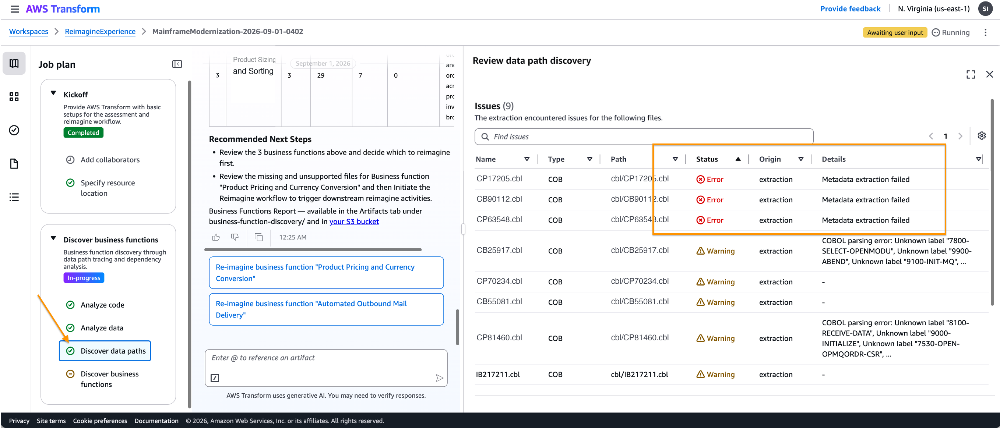
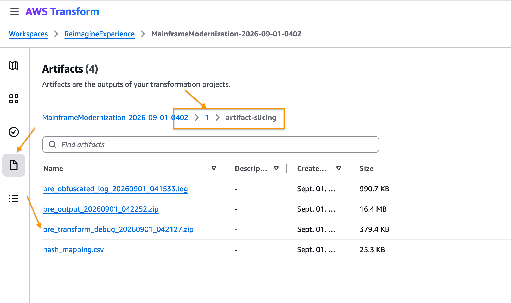

# Identify and Fix ATX Codebase Issues

Toolkit for diagnosing and resolving AWS Transform for mainframe (ATX)
"Discover data paths" extraction errors/warnings on mainframe codebases
(COBOL, PL/I, and other supported source languages).

## The problem

During AWS Transform's "Discover data paths" step in **Discover business functions** task, the **Issues** panel
lists extraction **Errors** and **Warnings** per artifact, with columns
for Name, Type, Path, Status, Origin, and Details:

Errors (e.g. "Metadata extraction failed") and Warnings (e.g. "COBOL
parsing error: Unknown label ...") appear in the **Status** column,
outlined above. These block or degrade downstream reimagine/business-
function-discovery steps. The root cause is rarely obvious from the
console message alone — it often requires the analyzer's diagnostic
bundle plus the original source to properly triage.

*The same approach can be adopted if you have selected "2. Reimagine" path as main objective at the start of the Mainframe Modernization job. The issue details are shown when you click the "Extract business logic" step.*

## Collecting the diagnostic bundle

The diagnostic bundle needed to triage these issues is **not** the
Issues panel itself — it's a separate downloadable artifact. In the job's
**Artifacts** tab, navigate into **`1` → `artifact-slicing`** and
download **`bre_transform_debug_*.zip`** (not `bre_output_*.zip` or the
obfuscated log):

You'll also need the original source zip submitted to the job.

## Prerequisites

- Python 3 installed and available on your `PATH` (check with
  `python3 --version`). No third-party packages are required — the
  skill's scripts use only Python's standard library.

## Using the kit

1. Download and expand [`dist/fix-atx-datapath-errors-kit.zip`](https://raw.githubusercontent.com/aws-samples/sample-mainframe-modernization-agent-skills/main/1-reverse-engineering-toolkits/identify-and-fix-atx-codebase-issues/dist/fix-atx-datapath-errors-kit.zip).
2. Open the expanded folder as a workspace in Kiro, or place the
   `skills/fix-atx-datapath-errors/` folder in the equivalent path for
   another AI tool:

   | Tool | Where to place the skill folder |
   |---|---|
   | [Kiro](https://kiro.dev/docs/skills/) | `.kiro/skills/fix-atx-datapath-errors/` (workspace) or `~/.kiro/skills/fix-atx-datapath-errors/` (global) |
   | [Claude Code](https://code.claude.com/docs/en/skills) | `.claude/skills/fix-atx-datapath-errors/` (project) or `~/.claude/skills/fix-atx-datapath-errors/` (personal) |
   | [Codex](https://developers.openai.com/codex/build-skills) | `.agents/skills/fix-atx-datapath-errors/` (repo) or `~/.agents/skills/fix-atx-datapath-errors/` (global) |
   | [Cursor](https://cursor.com/docs/skills) | `.cursor/skills/fix-atx-datapath-errors/` or `.agents/skills/fix-atx-datapath-errors/` (project); `~/.cursor/skills/` or `~/.agents/skills/` (global) |
   | [GitHub Copilot](https://docs.github.com/en/copilot/how-tos/use-copilot-agents/coding-agent/create-skills) | `.github/skills/fix-atx-datapath-errors/` (project); `~/.copilot/skills/` or `~/.agents/skills/` (personal) |
   | [Devin](https://docs.devin.ai/product-guides/skills) | `.agents/skills/fix-atx-datapath-errors/` (commit to repo; also scans `.devin/`, `.github/`, `.claude/`, `.cursor/`, `.codex/` skills folders) |

   The skill follows the open [Agent Skills](https://agentskills.io)
   standard, so the folder works unmodified in any of them — just copy
   or symlink it to the path above, don't rename it.
3. Collect the two files above and place them in the kit's `input/`
   folder.
4. Prompt the AI agent, e.g.: *"Use the fix-atx-datapath-errors skill to
   analyze the files in `input/` and fix what you can. Write results to
   `output/`."*

The agent writes `output/target_fixed.zip` (safe, business-rule-neutral
fixes applied; unfixable files removed and documented) and
`output/report.md` summarizing every finding, fix, and removal. Full
detail and guardrails are in the kit's `skills/fix-atx-datapath-errors/SKILL.md`.

## License

This library is licensed under the MIT-0 License. See the LICENSE file.